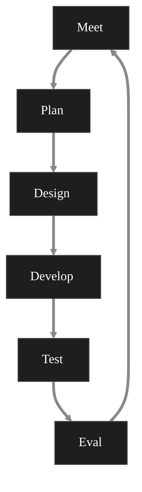

# Basic Terms of ASD 
1. **Agile**: A flexible and iterative approach to software development that focuses on collaboration, customer feedback and frequent releases. 
2. **Scrum**: 
	- A popular agile framework used to manage work 
	- It divides work into small cycles called as **Sprints**
3. **Sprints**: A time box periods (1-4 weeks) during which a set of tasks is completed and reviewed. 
4. **Product Backlog**: A list of all features, tasks and improvements needed in the product. It is maintained by the product owner 
5. **Sprint Backlog**: A subset of the product backlog chosen for a specific sprint 
6. **User Story**: A small simple description of a feature from the user's perspective 
7. **Product Owner:** The person who: 
	- Defines product requirements 
	- Prioritizes the backlog 
	- Represents customer needs 
8. **Scrum Master**: The person who facilitates the scrum process
	- removes the obstacles 
	- Help the team follow agile principle 
9. **Development Team**: A group of professionals who design, develop and deliver the product 
10. **Daily Scrum**: A short daily meeting (15 minutes) where team members answer: 
	1. What I did yesterday?
	2. What will I do today? 
	3. Any blockers or something
11. **Sprint Planning**: Meeting where the team decides: 
	1. what to work in the sprint
	2. How to do it
12. **Sprint Review**: A meeting at the end of the sprint to: 
	1. Demonstrate completed work 
	2. get feedback  
13. **Sprint Retrospective**: A meeting to discuss: 
	- what went well
	- what didn't 
	- how to improve
14. **Increment**: The working version of a product after a sprint 
15. **Burndown Chart**: A graph that shows: 
	1. Work remaining vs Time 
	2. Help track the sprint progress 
16. **Velocity**: Measures how much work a team completes in one sprint 
17. **DOD (Definition of Dull)**: A checklist that defines when a task if officially complete 
18. **MVP (Minimum Viable Product)**: A smallest version of a product with enough features to satisfy early users 
19. **Kanban Kaizen** 

# Agile Software Development Process 

# ASD 
- Flexibility 
- Collaboration 
- Customer Satisfaction 
- Welcoming Changes 
- Working Software
Agile Software Development leads to Low Product Failure Rate (PFR)
ASD is a software development methodology that values flexibility, collaboration and customer satisfaction 
# Difference between Agile and Waterfall Model 
| **Feature**          | **Agile**                 | **Waterfall**                     |
| -------------------- | ------------------------- | --------------------------------- |
|                      | Iterative and Incremental | Linear and Sequential Model       |
| Flexibility          | Highly Flexible           | Very rigid                        |
| Changes              | Easy and Welcome          | Difficult and Costly              |
| Customer  Involvment | Constant Interaction      | Only at the beginning and the end |
| Delivery             | Frequent Small Releases   | Final product at the end          |
| Documentation        | Lightweight Documentation | Heavy Documentation               |
| Risk                 | Low                       | High                              |
# ASD Lifecycle and Process

```mermaid
%%{
init: {
'theme': 'base',
'themeVariables': {
'primaryColor': '#1e1e1e',
'primaryTextColor': '#ffffff',
'primaryBorderColor': '#444444',
'lineColor': '#888888',
'nodeBorder': '#444444',
'mainBkg': '#1e1e1e',
'defaultLinkColor': '#888888',
'fontFamily': 'ui-monospace, monospace'
}
}
}%%
graph
%% Nodes
Root[<b>Agile Software Development</b>]
Req[Requirement Gathering]
Plan[Planning]
Dev[Development]
Test[Testing]
Dep[Deployment]
Maint[Maintenance]
%% Connections
Root === Req
Root === Plan
Root === Dev
Root === Test
Root === Dep
Root === Maint
%% Individual Styling for the Root
style Root fill:#333,stroke:#fff,stroke-width:2px
```

# Core Values of ASD 
1. Individuals and Interactions over processes and tools
2. Working Software over comprehensive documentation
3. Customer Collaboration over contract negotiation 
4. Responding to change over following a plan 
# 12 Principles of ASD 
1. Customer Satisfaction
2. Changing Requirements
3. Frequent Delivery
4. Promoting Collaboration
5. Motivated Individuals
6. Face to Face communication
7. Maintain a constant pace
8. Measure the progress
9. Technical Excellence 
10. Simplicity 
11. Self Organized Teams
12. Continuous Improvements
# Advantages and Disadvantages of ASD
## Advantages
- Flexibility
- Increased Communication
- Improved quality 
- More reliable 
- Enhanced customer satisfaction 
- Increased Team Motivation 
- Continuous Alteration
- People not process
## Disadvantages
- Documentation 
- Risk of not finishing 
- Team Dependency 
- In case of large products, dealing with customers is difficult

# LSD (Lean Software Development)
- LSD aims at optimizing efficiency and minimizing waste in the software development process 
- Helpful at:
	- Prevents Defects 
	- Eliminate waste
	- Fast Delivery
	- Delay Decisions 
## Seven Principles of LSD 
1. Eliminate the waste 
2. Fast Delivery 
3. Amplify Learning 
4. Builds Quality
5. Respect Teamwork 
6. Delay the commitment 
7. Optimizing the whole system 
## LSD Process 
- Identify the Value 
- Map the values tree 
- Create Flow 
- Establish Pull
- Seek Perfection 
- Build Quality 
- Empower Team 
## LSD vs Agile 

| Feature               | LSD                                                                  | Agile                                                            |
| --------------------- | -------------------------------------------------------------------- | ---------------------------------------------------------------- |
| Focus                 | The focus is on waste elimination and optimization                   | Focus is on Customer Collaboration and Iterative Delivery        |
| Process and Practices | Kanban & Kaizen                                                      | Scrum                                                            |
| Feature               | Delay Decision until necessary                                       | Flexible and Adaptive to changes as they rise                    |
| Customer Involvment   | It involves understanding and delivering customer value continuously | It involves continuous collaboration and feedback from customers |
| Advantages            | Fast Delivery, Prevents Defects                                      | Flexibility, Customer Satisfaction                               |
| Limitation            | It requires strong leadership, difficulty in measuring waste         |                                                                  |
# Kaizen & Kanban
- High quality software quickly
- Reduce Waste 
- High efficiency 
ASD aims to deliver high quality software quickly while adapting to change and continuously improving. Two important Lean concepts that strongly support Agile:
1. Kaizen 
2. Kanban 
Both help teams become more efficient, reduce waste and improve customer satisfaction but in different ways. 
## Kaizen in ASD 
It's a Japanese word that means 'change for the better' or continuous improvement. It emphasizes making small incremental improvements regularly rather than making large changes all at once.  
### **Philosophy of Kaizen** 
Kaisen is based on the philosophy that:
1. No process is perfect 
2. Everything can be improved 
3. Improvement should never stop
4. Everyone in the team contributes 
5. Instead of waiting for problems to become big, teams solve small problems early preventing them from growing 
# 