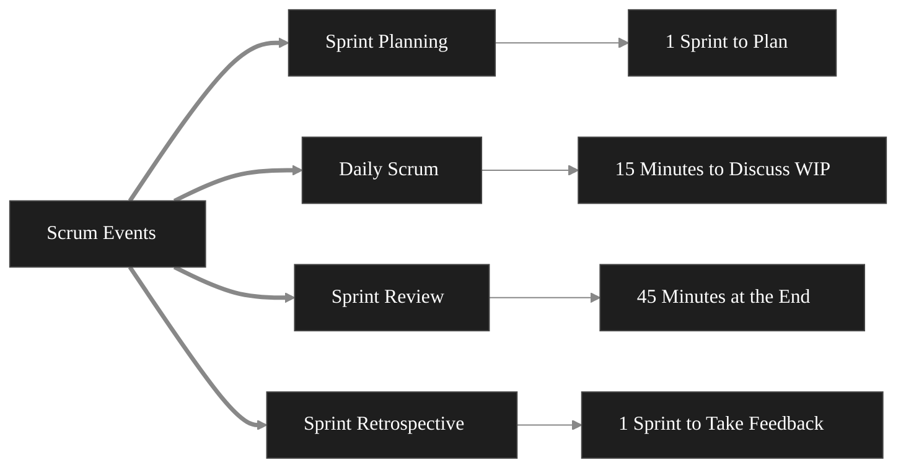
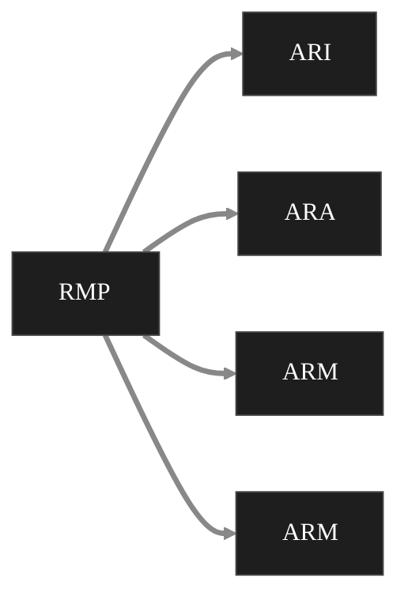

# Agile Manifesto or Manifesto of ASD 
- Foundational Document 
- 17 Developers made it in 2001 
- 4 Core Values 
- 12 Principles 
It is a set of foundational principles for ASD that emphasize flexibility, collaboration and Customer Satisfaction. It includes 4 core values, 12 Principles. 
## Core Values of ASD 
1. Individuals and Interactions over processes and tools
2. Working Software over comprehensive documentation
3. Customer Collaboration over contract negotiation 
4. Responding to change over following a plan 
## 12 Principles of ASD 
1. Customer Satisfaction
2. Changing Requirements
3. Frequent Delivery
4. Promoting Collaboration
5. Motivated Individuals
6. Face to Face communication
7. Maintain a constant pace
8. Measure the work progress
9. Technical Excellence 
10. Simplicity 
11. Self Organized Teams
12. Continuous Improvements
## Steps to use Agile Manifesto 
1. Focuses on Agile core values
2. Adopt Agile Frameworks 
3. Iterate and Improve 
4. Engage with customers 
# Agile Product Backlog (APB)
APB is a prioritized set of new features, changes to existing features, bug fixes from what was already on and any other work item that a team may develop or deliver for the product. 
## Components of APB 
1. User Stories and Work Items 
2. Prioritization of the backlog item 
3. Estimation of each work item (cost, resources, time)
## Creating and Maintaining the APB 
1. Initial Creation 
2. Continuous Refinement 
## Tools and Software for APB 
1. Jira 
2. Product Board 
3. nTask 
4. Backlog 
5. Teamwork 
6. Monday.com 
7. Feed bear 
8. Craft.io 
9. clickUp 
# Scrum 
Scrum Artifacts: Information 
- To develop 
- To produce 
- For actions 
## Main Artifacts:
1. Product backlog 
2. Sprint Backlog 
3. Increments 
## Scrum Events: 
- Discuss work 
- Discuss Work in Progress 
- Take Feedback 
## Scrum Ceremonies 

## 7 Common Principles:
1. Working software is a key measure of progress 
2. Software should be developed and delivered rapidly in small increments 
3. Even the late changes in the environment should be entertained 
4. Face to Face communication preferred over documentation
5. Continuous Feedback and involvement of customer is necessary 
6. Simple Design 
7. Deliver Dates are decided by the compete team
## Good Practices in XP 
1. Code Review 
2. Testing 
3. Incremental Development 
4. Simplicity 
5. Design 
6. Integration Testing 
7. Listening 
8. Simiplicity
9. Pair Programming 
10. Continuous Integration 
11. Refactoring  
## Applications of XP 

## Life cycle of XP 

# FDD (Feature Driven Development)
It is an aglie and iterative and incremental model that focuses on progressing the features of the developing software .
## Features of FDD 
- Timely Updates and delivery of working software to the client  
## Core Principles: 
1. Feature Centric 
2. Iterative and Incremental 
3. Model Driven 
## Key Activities 
1. Develop an overall model 
2. Build feature list 
3. Plan by feature 
4. Design by feature 
5. Build by feature  
## Benefits 
1. Clarity 
2. Visibility 
3. Client Focused 
4. Scalability 
5. Frequent Releases 
## Disadvantes/Challenges 
1. Not suitable for small projects 
2. High dependency on designers and developers 
3. Lack of Documentation  
# Agile Risk Management (ARM)
- Threats 
- Serious problems 
- Risks 
## Agile Risk Identification 
1. Risk identification enables the project experts to recognize and record the potential threats to the project. 
2. This process prevents a serious impact of the issue or risk on the successful execution. 
3. It allows us to predict the challenges in advance 
### Various methods: 

| Risk Identification Method | Description                 |
| -------------------------- | --------------------------- |
| Analyzing project scope    | Data Security               |
| Review of Historical Data  | Learn from past experience  |
| Probability Analysis       | Prioritize High Impact Risk |
| Involving Stakeholders     | Regular Feedback            |
|                            |                             |
## Risk Management Process (RMP) 

## Categories of Risk: 
1. Regulatory Risk: Changes Made
2. Security Risk: Cyber Risk 
3. Technical Risk: Risk in the development 
4. Business Risk: Risk involving Money 
5. User Acceptance Risk: Will the user deny or accept 
## Techniques 
1. Risk Analysis 
2. Risk planning 
3. Monitoring and Control 
4. Implementing Mitigation strategies 
5. Embedding risk management 
6. Building a risk aware culture 
## Process of ARM
- Risk Identification 
- Risk Analysis
- Risk Response 
- Monitoring and control 