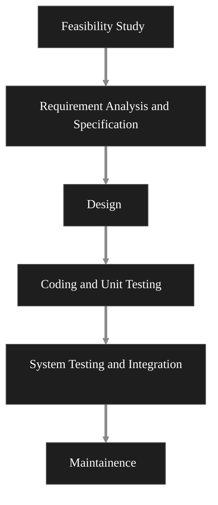
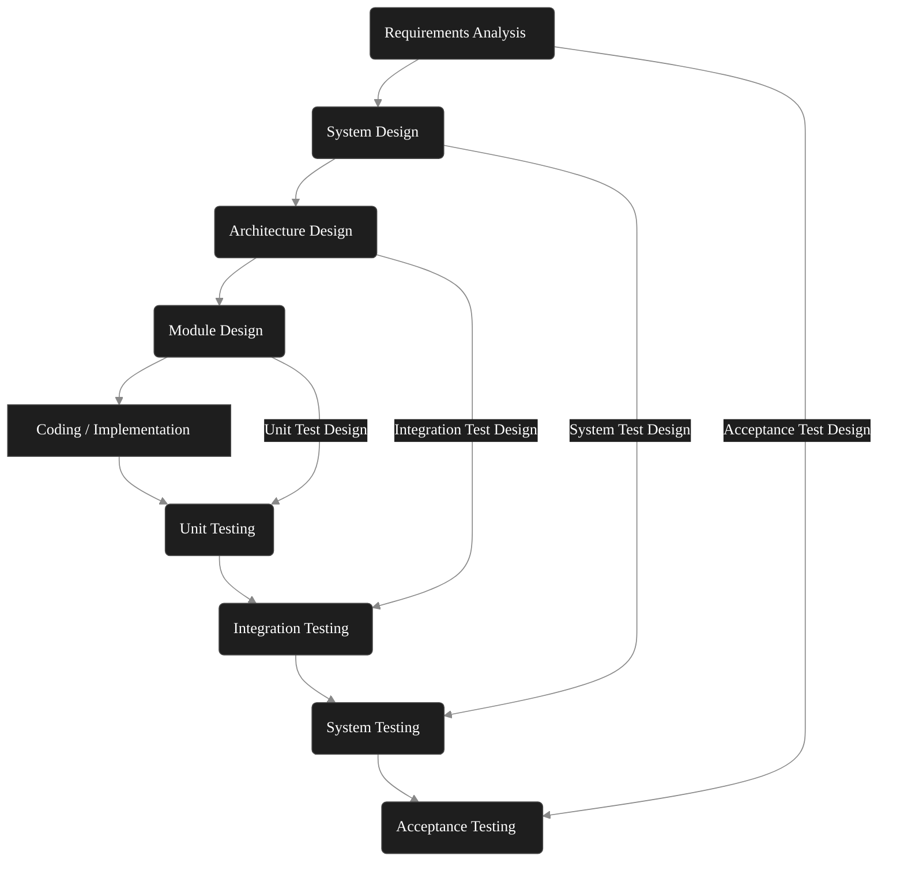

# Introduction to Design Thinking
## Meaning of Design Thinking 
Design thinking is not just property of designers but all the great inventors of engineering , science, literature, art, music and businesses have used it. Design thinking supports in developing teaching, learning, thinking and applying strategies to solve complications in a creative manner in projects and processes of business. 
## Definition 
Design thinking is a term used to denote a set of strategic, conceptual and practical processes in which design concepts are developed. Many key concepts of design thinking have been identified through studies across all different design fields, design concepts, and design work in both laboratories and environmental contexts. 
Design Consideration are also linked to the establishment of products and services within the business and social environments. Some of these guidelines have been criticized for simplifying the design process and undermining the role of technical knowledge and skills. 
# Features of Design Thinking
1. Design thinking understands from the perspective of the customers and provides solutions for improving the product and service quality in the organization. 
2. The role of design thinking is to collect feedback from the customers and employees by iteration of prototyping 
3. Expanding the range of solutions to the problem identified in the organization and employee for better customer and employee satisfaction 
4. Enable the design thinkers to develop new products and services to the customers and process satisfaction. 
5. Providing ecosystem through the interaction with the employees and the customers. 
# Principle of Design Thinking 
It seems Design thinking is about how to think and act as it is about the process. The process is obviously important and there are certain tested tools that need to be considered within each mode, each with its own set of inputs, outputs and well defined functions. Aside from the processes, design thinking is also about thinking where the concept can be thought of as an integrated set of beliefs and aptitudes. 
## Human Focused Design Thinking  
The process that understands from the perspective of the human including the employee and customers. While doing so, design thinkers need to consider the individual belief values and attitudes. 
## Diversity to Work in a Team
Design thinking needs to consider individuals from different backgrounds and trained to work in a team. While group membership should be balanced throughout the project. It maybe wise to occasionally include outside organization participants for a specific modes or activities. 
## Comprehensive 
Although details are important, design experts are also able to identify and consider relations, collaborations between different ideas. 
## Flexibility and unconventional comfort
Design thinking is best suited to deal with problems and opportunities described in an incomprehensible way and requires great flexibility in terms of both content and methodology. 
## Communication Skills 
It is willingness to communicate and work in a variety of ways including speaking, writing, visual and touch. Design experts design and build prototypes without the perceived lack of skills and competence. 
# Stages of Design Thinking 
Design thinking model proposed by the Hasso Plattner institute of design at Stanford. The school proposed 5 phase design thinking model. According to design school, the 5 phases are:
1. Empathy
2. Explain (Define)
3. Ideate 
4. Prototype 
5. Assessment (Testing)
## Empathy 
The first step in the design process is to gain a critical understanding of the problem we are trying to solve. This step involves putting oneself into the shoes of customer or the end user of our solution. We need to understand the problem faced by the customer and we as design thinkers need to realize the feelings of the customers. 
This step involves consulting with experts to find out more about the area of concern, to consult and discuss with people to understand their experiences and motives. Then immerse themselves in a visible environment to gain a deeper personal understanding of the issues involved. 
Sensitivity is a very important in a person centered design process and it allows designers to set aside their ideas about the world in order to gain an understanding of user and their needs. Depending on the time limit a large amount of information is collected in this section for the use during the next phase and to develop a better understanding of user and their needs and the problems that underpin the development of that particular product. 
## Explain (Define)
During the define stage we combine the information we have created and collected during the empathy stage/phase. This is where analyze what we have seen and put it together to explain the core values that our team have identified so far. The problem should be described as a problem statement in a person centered way. For example, instead of describing a problem as your wish or business need such, as we need to increase our market share of food products among young girls by 5%. The best way to describe the problem would be young girls need nutritious food, to be healthy and grow. 
Define forum will help designers in the team to come up with great ideas, for creating features, functions or any other features that will allow them to solve problems. 
## Ideate
During the third phase of the design thinking process, designers are ready to begin producing ideas. Now you have grown to understand your users or customers and their needs in previous sections and have analyzed and summarized what you have seen in the define section and ended up with a problem focused problem statement. With this solid domain/background, team members can start thinking 'outside the box' to see new solutions to the problem statement and you can start looking at other ways to look at the problem. Ideas at the end of this section will help you to investigate and evaluate your ideas to find the best way to solve a problem or provide necessary features to avoid it. 
## Prototype 
The team of designers will now produce less expensive discounted version of the product or specific features found within the product, in order to be able to investigate solutions to the problems developed in the previous section. Prototype maybe shared and tested within the team itself or in other departments or in a small group of people outside the design team as and when required. This is the testing phase and the aim is to identify the best solution for each problem identified during the first three phases. Solutions to applied to prototypes and individually are investigated and adapted, developed and tested or rejected on the basis of user knowledge. By the end of this section, the design team will have a better idea of existing product and the problem and have a clear idea of how a real user will behave, think and feel about the product and services. 
## Testing/Assessment 
Designers or testers formally test the complete product using the best solution identified during the simulation phase. This is the final phase of the 5 phase model but with a recurring process. The result produced during the testing phase are often used to redefine one or more problems and inform user's understanding uses condition and how people think and behave about the products and services. Even in this phase, changes and improvements are made to solve problems are gain as much insight into the product and it's users as possible. 
# Software Development Methodology
In the software business, the waterfall model and V-model are both highly popular development approaches. Both of these provide systematic assistance for the creation of software and applications. 
## Waterfall Model 
The waterfall model is a traditional software development methodology that follows a linear phase by phase approach where each phase must be completed before moving to the next phase. 
It does not allow backtracking and permits only minimal changes once a phase is completed 

### Features of Waterfall Model 
1. Sequential Approach: Development follows a linear step by step process where each phase is completed before moving to the next. 
2. Document Driven Process: Detailed documentation is created at every stage to clearly define requirements, design and progress. 
3. Detailed Planning: The project scope scheduled and deliverable are carefully planned and monitored throughout the lifecycle.
### Phases of Waterfall Model:
1. Feasibility Study:
	- The feasibility study contains technical and financial details of the project. 
	- As per requirement, and client budget the study is performed. 
2. Requirement analysis and specification 
	- This phase focuses on clear understanding and documenting the customer needs. 
	- Customer requirements are collected to and carefully examine to remove any errors, confusions and inconsistencies 
	- The approved requirements are documented in the software requirement specification(SRS) which serves as a formal agreement between the customer and the development team. 
3. Design 
	- 
## V-Model Graph 

# Elements and Principles of Design 
The elements and principles of design are fundamental concepts that guide the creation of visually appealing functional and cohesive design. Understanding and applying these elements and principles allow designers to effectively communicate message, create engaging visuals, and ensure that  there design are both aesthetically pleasing and funcional.
## Elements of design 
The elements of design are basic building blocks used to create a composition. They are 
- Dot : 
	- The most basic unit of design 
	- A dot is a small mark or point in space. 
	- When used strategically, dot can form patterns, lead the viewers eyes and create focal points. 
- Line:
	- A line is a continuous mark made by a moving point. 
	- Lines can vary in thickness, direction, length, and styles. 
	- Line can divide, create shape and suggest movement or direction. 
- Shape:
	- Shape refers to a 2D area created by lines or boundaries. shapes can be geometric (squares, circles, triangles) or organic (irregular or freeform) 
	- Shapes define the structure of design and are the foundation for creating patterns, illustrations and other elements 
- Form:
	- Form is a 3D counterpart to shape. 
	- It has depth in addition to height and width making it appear as if it has mass or volume. 
	- Forms can be geometric (cubes, spheres) or organic (irregular or free-form) 
- Color:
	- Color plays a significant role in design, evoking emotions and setting the tone 
	- It includes hue, the name of color, value (lightness / darkness) and saturation (intensity/purity)
	- Colors can create contrast, highlight the elements and add depth to the design. 
- Texture:
	- Texture refers to the surface quality of an object. It can be visual (what we percieve) or tactile(what we feel physically) 
	- Texture adds interest, dimension, and depth to a design and can be used to convey the feeling of a material.
- Space: 
	- Space refers to the area around, between and within element of a design 
	- It can be positive (occupied by elements) or negative (empty space)
	- The effective us of space helps create balance, clarity and focus in a design 
	- Proper space management avoids overcrowding and creates harmony
## Principles of Design 
The principles of design refer to the rules and guidelines that help organize the element in a design. These principles ensure that design are well balanced, harmonious, and effective in conveying the intended message. Key principles include:
- Balance 
	- Balance refers to the distribution of visual weight in a design 
	1. Symmetrical Balance 
		- Elements are arranged evenly around a central point creating a formal and stable look 
	2. Asymmetrical Balance 
		- Elements are arranged unevenly creating a more dynamic and informal composition 
	3. Radial Balance 
		- Elements radiate outwards from a central point creating a circular or spiral effect 
- Contrast 
	- Contrast is the difference between two or more elements in a design 
	- it involves differences in color, size, shape or texture. 
	- Contrast helps create emphasis and add visual interest 
	- For example: dark text on a light background is a contrast in value 
- Emphasis 
	- Emphasis is the focal point of a design where the eye is naturally drawn first 
	- It is achieved by making certain elements stand out through contrast, size, shape, color, or positioning. 
	- Emphasis ensures that the most important part of the design is noticed first  
- Movement 

# Case Studies:
- [Design by Berkeley](https://guides.lib.berkeley.edu/design)
- [Design by Vanseo Design](https://vanseodesign.com/web-design/design-elements/)
- [Building Blocks of Visual Design by Interaction Design](https://www.interaction-design.org/literature/article/the-building-blocks-of-visual-design)

# Redesign for Blind User 
1. People face problem, 
