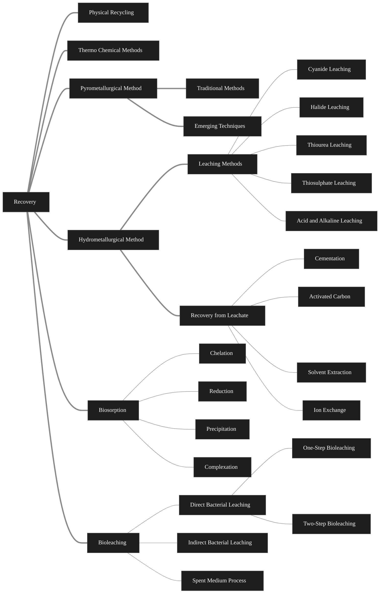
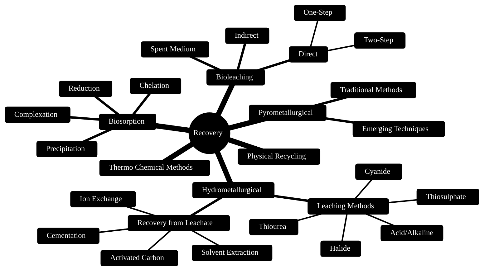

- E-waste is any electrical or electronic equipment that's been discarded. This includes working  and broken items that are thrown in the garbage or donated or a charity reseller by Goodwill.
- E-waste is a combination of used or unwanted electronic  products which have exceeded their shelf life 
- Lead is a common substance released into the environment when e-waste is recycle, stored or dumped using informal activities, including open burning 
- E-waste categories: 
	- temperature exchange equipment
	- screens, monitors 
	- lamps 
	- large machines and equipment  
	- Small equipment and machines 
	- Small IT and telecommunication Equipment 
# Why is E-waste a problem? 
- Composed of hazardous materials 
- Products are quickly obsolete and discarded 
- Electronic products are difficult to recycle 
- Electronics managed badly 
- Most e-waste goes to landfills 
- prison recycling can lead to gangs being formed for tech
- Most recycle companies don't recycle, they instead export to other countries 
# Recovery Methods

