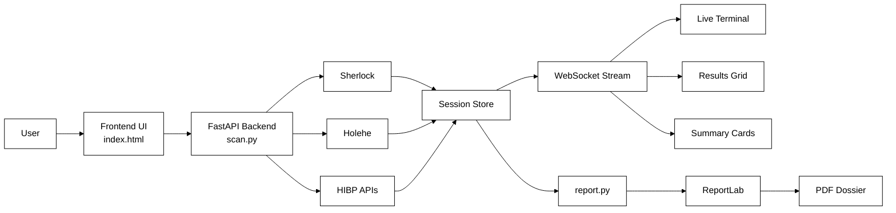
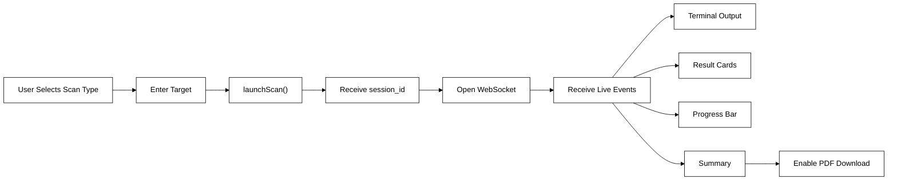
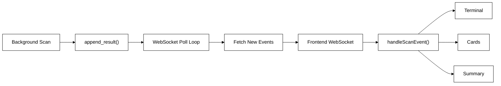

```mermaid 
%%{  
init: {  
'theme': 'base',  
'themeVariables': {  
'primaryColor': '#ffffff',  
'primaryTextColor': '#000000',  
'primaryBorderColor': '#000000',  
'lineColor': '#000000',  
'secondaryColor': '#ffffff',  
'tertiaryColor': '#ffffff',  
'background': '#ffffff',  
'mainBkg': '#ffffff',  
'secondBkg': '#ffffff',  
'tertiaryBkg': '#ffffff',  
'clusterBkg': '#ffffff',  
'clusterBorder': '#000000',  
'defaultLinkColor': '#000000',  
'edgeLabelBackground':'#ffffff',  
'nodeBorder':'#000000',  
'fontFamily': 'Arial'  
}  
}  
}%%

flowchart LR

A["User"] --> B["Frontend UI<br/>index.html"]

B --> C["FastAPI Backend<br/>scan.py"]

C --> D["Sherlock"]
C --> E["Holehe"]
C --> F["HIBP APIs"]

D --> H["Session Store"]
E --> H
F --> H

H --> I["WebSocket Stream"]

I --> J["Live Terminal"]
I --> K["Results Grid"]
I --> L["Summary Cards"]

H --> M["report.py"]

M --> N["ReportLab"]

N --> O["PDF Dossier"]
```

```mermaid 
%%{  
init: {  
'theme': 'base',  
'themeVariables': {  
'primaryColor': '#ffffff',  
'primaryTextColor': '#000000',  
'primaryBorderColor': '#000000',  
'lineColor': '#000000',  
'secondaryColor': '#ffffff',  
'tertiaryColor': '#ffffff',  
'background': '#ffffff',  
'mainBkg': '#ffffff',  
'secondBkg': '#ffffff',  
'tertiaryBkg': '#ffffff',  
'clusterBkg': '#ffffff',  
'clusterBorder': '#000000',  
'defaultLinkColor': '#000000',  
'edgeLabelBackground':'#ffffff',  
'nodeBorder':'#000000',  
'fontFamily': 'Arial'  
}  
}  
}%%

flowchart LR

A["User Selects Scan Type"] --> B["Enter Target"]

B --> D["launchScan()"]

D --> E["Receive session_id"]

E --> F["Open WebSocket"]

F --> G["Receive Live Events"]

G --> H["Terminal Output"]

G --> I["Result Cards"]

G --> J["Progress Bar"]

G --> K["Summary"]

K --> L["Enable PDF Download"]
```

```mermaid 
%%{  
init: {  
'theme': 'base',  
'themeVariables': {  
'primaryColor': '#ffffff',  
'primaryTextColor': '#000000',  
'primaryBorderColor': '#000000',  
'lineColor': '#000000',  
'secondaryColor': '#ffffff',  
'tertiaryColor': '#ffffff',  
'background': '#ffffff',  
'mainBkg': '#ffffff',  
'secondBkg': '#ffffff',  
'tertiaryBkg': '#ffffff',  
'clusterBkg': '#ffffff',  
'clusterBorder': '#000000',  
'defaultLinkColor': '#000000',  
'edgeLabelBackground':'#ffffff',  
'nodeBorder':'#000000',  
'fontFamily': 'Arial'  
}  
}  
}%%

flowchart LR

A["POST Request"] --> C["sanitizer.py"]

C --> E["Session Creation"]

E --> F["Background Scan Worker"]

F --> G["Append Events"]

G --> H["SessionStore"]

H --> I["Mark Session Complete"]

I --> J["Store Summary"]
```

```mermaid 
%%{  
init: {  
'theme': 'base',  
'themeVariables': {  
'primaryColor': '#ffffff',  
'primaryTextColor': '#000000',  
'primaryBorderColor': '#000000',  
'lineColor': '#000000',  
'secondaryColor': '#ffffff',  
'tertiaryColor': '#ffffff',  
'background': '#ffffff',  
'mainBkg': '#ffffff',  
'secondBkg': '#ffffff',  
'tertiaryBkg': '#ffffff',  
'clusterBkg': '#ffffff',  
'clusterBorder': '#000000',  
'defaultLinkColor': '#000000',  
'edgeLabelBackground':'#ffffff',  
'nodeBorder':'#000000',  
'fontFamily': 'Arial'  
}  
}  
}%%

flowchart LR

A["Username Input"] --> B["sanitize_username()"]

B --> D["Sherlock CLI"]

D --> E["Parse Output"]

E --> G["terminal Events"]

G --> H["Session Store"]

H --> I["WebSocket Stream"]

I --> J["Frontend Results"]
```

```mermaid 
%%{  
init: {  
'theme': 'base',  
'themeVariables': {  
'primaryColor': '#ffffff',  
'primaryTextColor': '#000000',  
'primaryBorderColor': '#000000',  
'lineColor': '#000000',  
'secondaryColor': '#ffffff',  
'tertiaryColor': '#ffffff',  
'background': '#ffffff',  
'mainBkg': '#ffffff',  
'secondBkg': '#ffffff',  
'tertiaryBkg': '#ffffff',  
'clusterBkg': '#ffffff',  
'clusterBorder': '#000000',  
'defaultLinkColor': '#000000',  
'edgeLabelBackground':'#ffffff',  
'nodeBorder':'#000000',  
'fontFamily': 'Arial'  
}  
}  
}%%

flowchart LR

A["Email Input"] --> B["sanitize_email()"]

B --> C["stream_holehe()"]

C --> D["Holehe CLI"]

D --> F["Session Store"]

F --> G["HIBP Breach API"]

G --> I["Session Store"]

I --> K["Frontend UI"]
```

```mermaid 
%%{  
init: {  
'theme': 'base',  
'themeVariables': {  
'primaryColor': '#ffffff',  
'primaryTextColor': '#000000',  
'primaryBorderColor': '#000000',  
'lineColor': '#000000',  
'secondaryColor': '#ffffff',  
'tertiaryColor': '#ffffff',  
'background': '#ffffff',  
'mainBkg': '#ffffff',  
'secondBkg': '#ffffff',  
'tertiaryBkg': '#ffffff',  
'clusterBkg': '#ffffff',  
'clusterBorder': '#000000',  
'defaultLinkColor': '#000000',  
'edgeLabelBackground':'#ffffff',  
'nodeBorder':'#000000',  
'fontFamily': 'Arial'  
}  
}  
}%%

flowchart LR

A["Password Input"] --> B["sanitize_password()"]

B --> C["SHA-1 Hash Locally"]

C --> E["HIBP Range API"]

E --> F["Receive Hash Suffixes"]

F --> J["WebSocket Stream"]

J --> K["Frontend Password Card"]
```

```mermaid 
%%{  
init: {  
'theme': 'base',  
'themeVariables': {  
'primaryColor': '#ffffff',  
'primaryTextColor': '#000000',  
'primaryBorderColor': '#000000',  
'lineColor': '#000000',  
'secondaryColor': '#ffffff',  
'tertiaryColor': '#ffffff',  
'background': '#ffffff',  
'mainBkg': '#ffffff',  
'secondBkg': '#ffffff',  
'tertiaryBkg': '#ffffff',  
'clusterBkg': '#ffffff',  
'clusterBorder': '#000000',  
'defaultLinkColor': '#000000',  
'edgeLabelBackground':'#ffffff',  
'nodeBorder':'#000000',  
'fontFamily': 'Arial'  
}  
}  
}%%

flowchart LR

A["Background Scan"] --> B["append_result()"]

B --> D["WebSocket Poll Loop"]

D --> E["Fetch New Events"]

E --> G["Frontend WebSocket"]

G --> H["handleScanEvent()"]

H --> I["Terminal"]

H --> J["Cards"]

H --> K["Summary"]
```

```mermaid 
%%{  
init: {  
'theme': 'base',  
'themeVariables': {  
'primaryColor': '#ffffff',  
'primaryTextColor': '#000000',  
'primaryBorderColor': '#000000',  
'lineColor': '#000000',  
'secondaryColor': '#ffffff',  
'tertiaryColor': '#ffffff',  
'background': '#ffffff',  
'mainBkg': '#ffffff',  
'secondBkg': '#ffffff',  
'tertiaryBkg': '#ffffff',  
'clusterBkg': '#ffffff',  
'clusterBorder': '#000000',  
'defaultLinkColor': '#000000',  
'edgeLabelBackground':'#ffffff',  
'nodeBorder':'#000000',  
'fontFamily': 'Arial'  
}  
}  
}%%

flowchart LR

A["Download PDF Button"] --> B["POST /report/generate/{session_id}"]

B --> C["Load Session"]

C --> D["Collect Results"]

D --> E["report.py"]

E --> F["ReportLab"]

F --> G["Generate PDF"]
```
